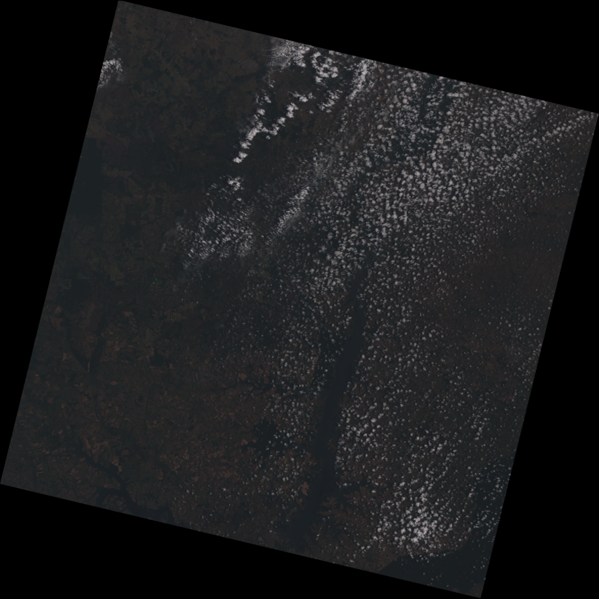
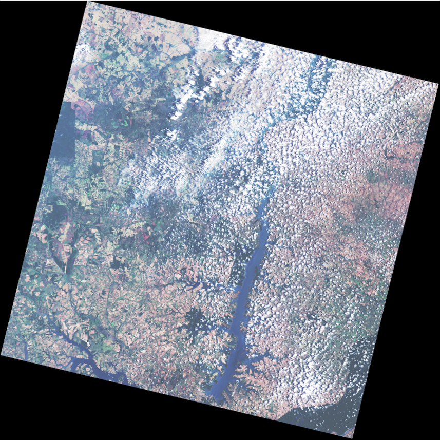
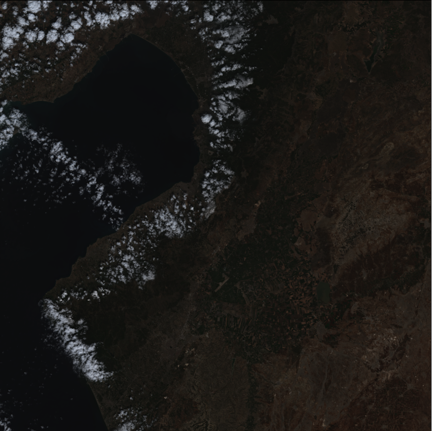
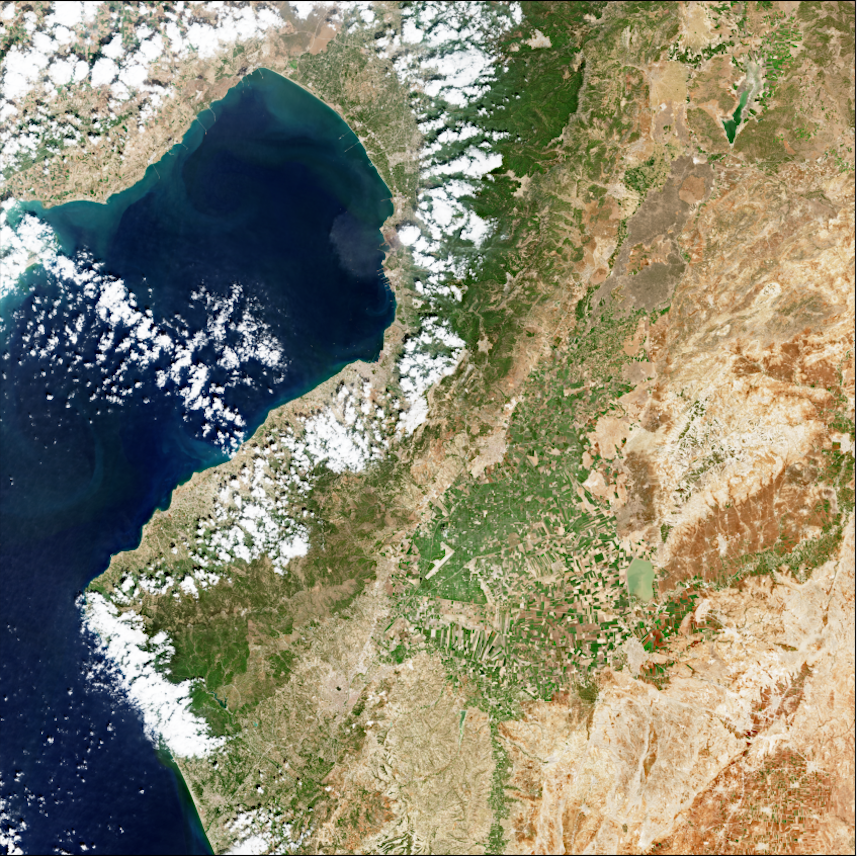

# Enhancement Strategies For Copy-Paste Generation & Localization in RGB Satellite Imagery 
<div align="center">
  
<!-- **Authors:** -->

**_¹ [Edoardo Daniele Cannas](linkedin.com/in/edoardo-daniele-cannas-9a7355146/), ² [Sriram Baireddy](https://www.linkedin.com/in/sbairedd/), ¹ [Paolo Bestagini](https://www.linkedin.com/in/paolo-bestagini-390b461b4/)_**

**_¹ [Stefano Tubaro](https://www.linkedin.com/in/stefano-tubaro-73aa9916/), ² [Edward J. Delp](https://www.linkedin.com/in/ejdelp/)_**


<!-- **Affiliations:** -->

¹ [Image and Sound Processing Laboratory](http://ispl.deib.polimi.it/), ² [Video and Image Processing Laboratory](https://engineering.purdue.edu/~ips/index.html)
</div>

This is the official code repository for the paper **Enhancement Strategies For Copy-Paste Generation & Localization in RGB Satellite Imagery**, accepted to the 2023 IEEE International Workshop on Information Forensics and Security (WIFS).  
The repository is currently **under development**, so feel free to open an issue if you encounter any problem.

<table>
  <tr>
    <td>
        
        Landsat8 sample, no equalization.
    </td>
    <td>
        
        Landsat8 sample, uniform equalization.
    </td>
  </tr>
  <tr>
    <td>
        
        Sentinel2A sample, no equalization.
    </td>
    <td>
        
        Sentinel2A sample, uniform equalization.
    </td>
  </tr>
</table>

# Getting started

## Prerequisites
In order to run our code, you need to:
1. install [conda](https://docs.conda.io/en/latest/miniconda.html)
2. create the `overhead-norm-strategies` environment using the *environment.yml* file
```bash
conda env create -f envinroment.yml
conda activate overhead-norm-strategies
```

## Data
You can download the dataset from this [link](https://www.dropbox.com/scl/fo/tr3r1ncmc0id58myc0ijf/h?rlkey=w0y5ohnya1t79smpon2w6za8m&dl=0).  
The dataset is composed of 2 folders:
1. `pristine_images`: contains the raw full resolution products (`pristine_images/full_res_products`) and the `256x256` patches extracted from them (`pristine_images/patches`);
2. `spliced_images`: contains the copy-paste images generated from the `pristine_images/patches/test_patches` using the `isplutils/create_spliced_rgb_samples.py` script.

In order to train the model, you first have to divide the dataset into training, validation and test splits.  
You can do this by running the [`notebook/Training dataset creation.ipynb`](notebooks/Training%20dataset%20creation.ipynb) notebook.

